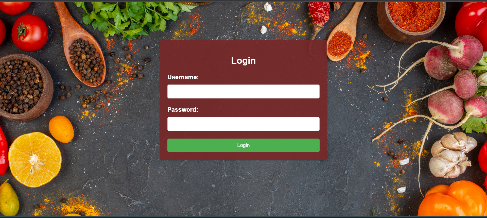
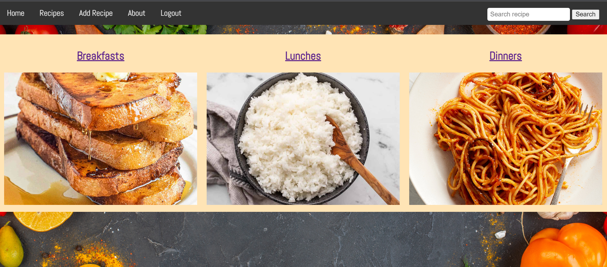
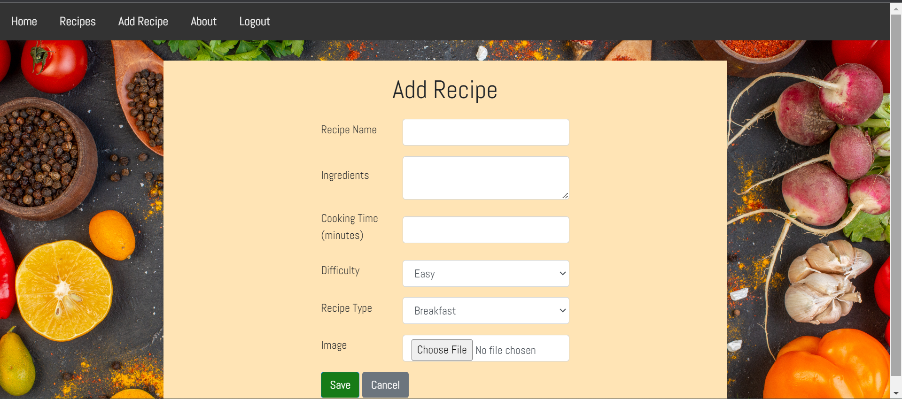

# Recipe App

The Recipe App is a web application built using Django, a Python web framework. It enables users to discover, create, and manage recipes effortlessly. Admins have access to a powerful dashboard for managing the recipe database.

## Table of Contents

- [Features](#features)
- [Technologies](#technologies)
- [Installation](#installation)
- [Usage](#usage)
- [Screenshots](#screenshots)
- [License](#license)

## Features

- **Recipe Creation**: Create, and delete your recipes with ease.
- **Recipe Search**: Find recipes by Name or Ingredient
- **Admin Dashboard**: Admins can perform CRUD operations on recipes and user accounts.
- **Responsive Design**: The app is designed to work seamlessly on various devices.

## Technologies

- **HTML, CSS & JAVASCRIPT**: For creating the structure, styling and interactivity for enhanced user experience.
- **Django**: A high-level Python web framework.
- **Python3**: The primary programming language.
- **MySQL**: The database management system for storing recipe data.

## Installation

Note: Run these commands in the terminal from the desired root directory

1. Clone the repo
   ```sh
   git clone https://github.com/RemanBalak/recipe-app.git
   ```
2. Install the requirements
   ```sh
   pip install -r requirements.txt
   ```
3. Migrate the database
   ```sh
   python manage.py migrate
   ```
4. Run the local server
   ```sh
   python manage.py runserver
   ```

## Usage

- Login with username: "Admin" and password: "RecipeHub01" (this is a standard account not currently able to delete recipes)
- To create a new recipe, navigate to the "Add Recipe" page and fill in the details
- Click on a "recipes" tab then double click to display it's details
- Click on the "Search" input to search recipes by Name or Ingredient (and see helpful charts).

## Project Links

Live Project: [https://recipehub-f3766f54da15.herokuapp.com/login/](https://recipehub-f3766f54da15.herokuapp.com/login/)

Project Repository: [https://github.com/RemanBalak/recipe-app](https://github.com/RemanBalak/recipe-app)

## Screenshots







## License

This project is licensed under the MIT License.

Happy cooking with the Recipe App! 🍳👩‍🍳👨‍🍳

-Reman
